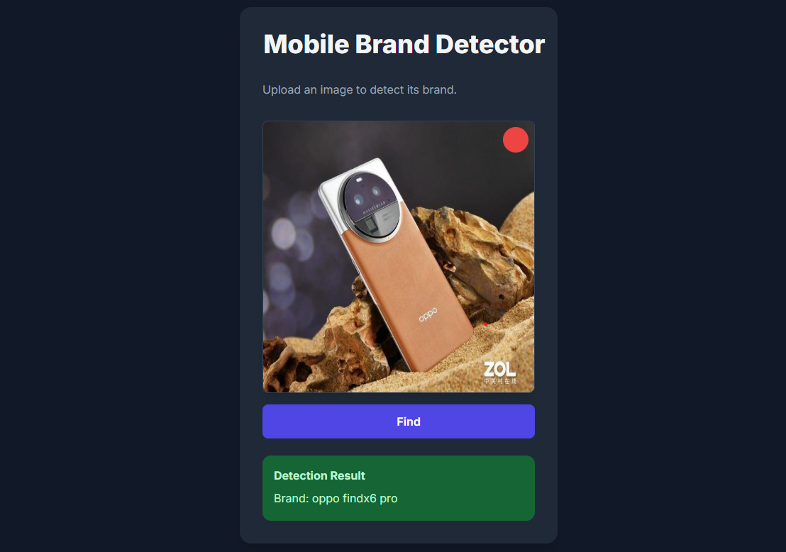

# Mobile Brand Detector



## Project Description

The **Mobile Brand Detector** is a complete, end-to-end project that uses deep learning to identify the brand and model of a mobile phone from an image. It solves the problem of visual product recognition by providing a full-stack solution, from the machine learning model to a user-friendly web interface.

The project is structured into a web service with a clear separation between the frontend and the backend.

## Technology Stack

* **Backend**: Python with the Flask framework to create a REST API.
* **Machine Learning**: TensorFlow and Keras for model training and inference. The model is a fine-tuned MobileNetV2 pre-trained on the ImageNet dataset, using transfer learning.
* **Frontend**: A single HTML file with embedded JavaScript and Tailwind CSS for a responsive and modern user interface.

## Setup and Installation

### Prerequisites

* Python 3.x
* pip (Python package installer)
* For faster model training, an NVIDIA GPU with CUDA and cuDNN is highly recommended but not required.

### Installation Steps

1. **Clone the Repository:**

   ```bash
   git clone https://github.com/Manvith-kumar16/Mobile-Brand-Detector.git
   cd Mobile-Brand-Detector
   ```

2. **Organize Your Dataset:**
   The model training script expects a specific data structure. Organize your images into a directory where each subdirectory is a class label (e.g., brand and model).

   ```
   data/
   └── train/
       ├── brand1_model1/
       │   ├── image1.jpg
       │   └── ...
       ├── brand2_model2/
       │   └── ...
   ```

3. **Install Dependencies:**

   ```bash
   pip install -r backend/requirements.txt
   pip install -r model_training/requirements.txt
   ```

## Usage Example

The project runs in two parts: the backend server and the frontend web page.

### Step 1: Train the Model

* Navigate to the `model_training` directory:

  ```bash
  cd model_training
  ```
* Open `train.py` and update the `DATASET_PATH` variable to point to your data directory.
* Run the script:

  ```bash
  python train.py
  ```
* The training script generates the model file (.h5) and the class labels file (.txt).

### Step 2: Run the Backend

* Navigate to the `backend` directory:

  ```bash
  cd backend
  ```
* Copy the generated `mobile_detector_model.h5` and `class_labels.txt` files from the `model_training` folder into this directory.
* Run the Flask server:

  ```bash
  python app.py
  ```

### Step 3: Access the Frontend

* Navigate to the `frontend` directory:

  ```bash
  cd frontend
  ```
* Open the `index.html` file in your web browser.
* The web page will connect to your local backend server, allowing you to upload images and see predictions.

## Project Structure Overview

```
Mobile-Brand-Detector/
├── backend/                  # The Python Flask API
│   ├── app.py                # Main backend script
│   ├── mobile_detector_model.h5 # Trained model (generated)
│   ├── class_labels.txt      # Class labels (generated)
│   └── requirements.txt      # Python dependencies for the backend
├── frontend/                 # The web user interface
│   └── index.html            # All frontend code (HTML, CSS, JS)
├── data/                     # Holds your raw dataset
│   └── train/                # The main training directory with labeled subfolders
├── model_training/           # Scripts for model training
│   ├── train.py              # The training script
│   └── requirements.txt      # Python dependencies for training
└── README.md                 # Project overview
```

## License

This project is licensed under the MIT License.

